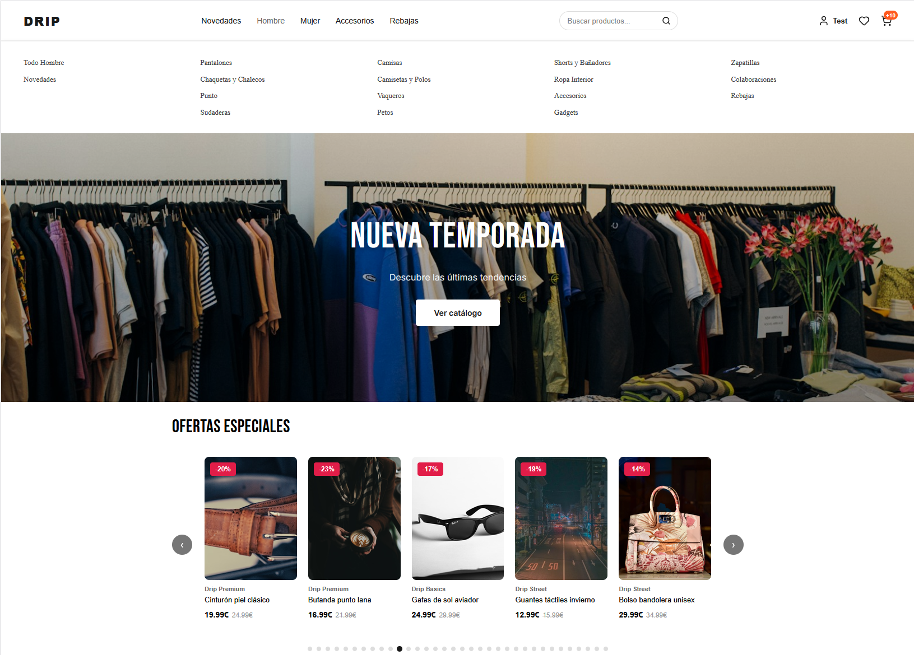
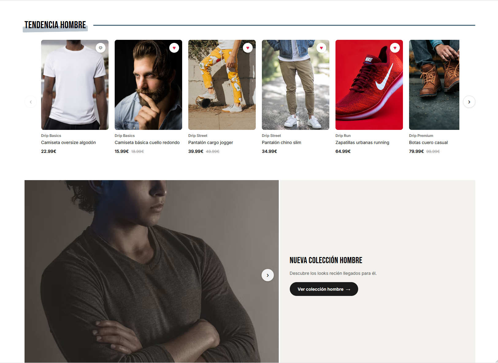
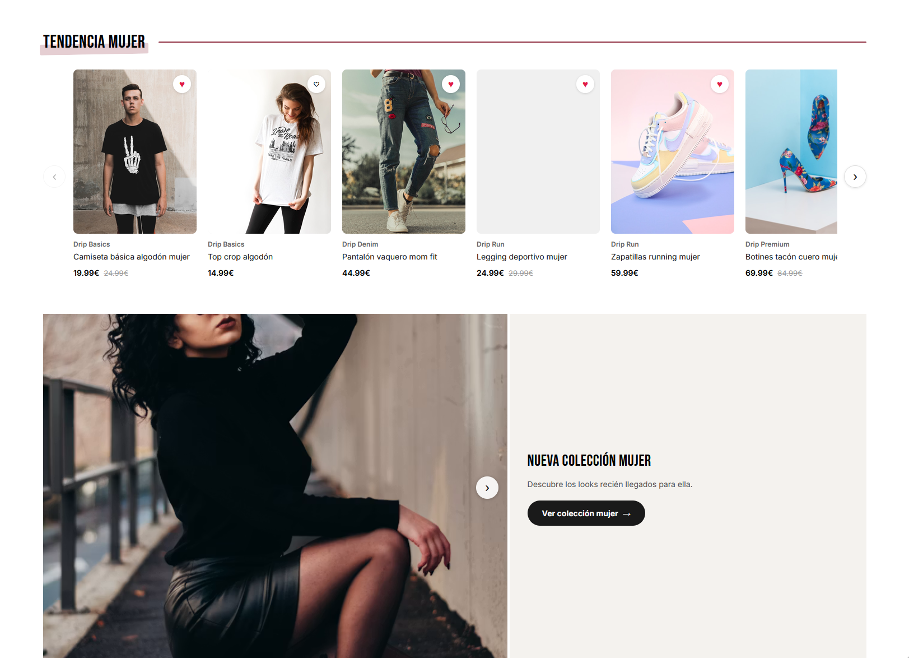
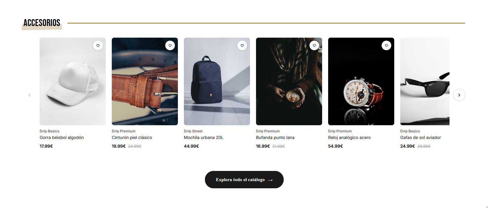
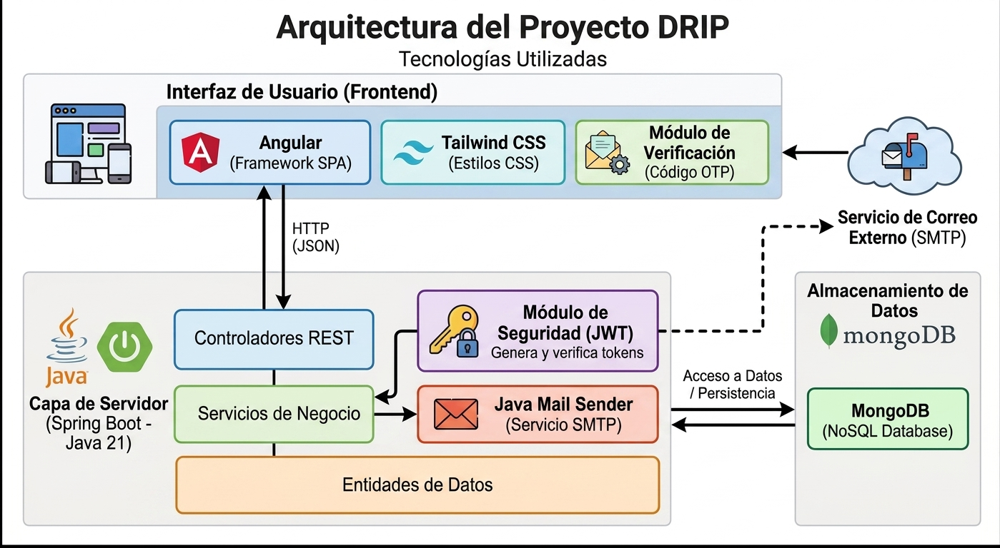

# DRIP — Marketplace de Moda


## 🌐 Demo en producción

- **Web (Frontend):** [alejandroquindimil.github.io/marketplace](https://alejandroquindimil.github.io/marketplace/)
- **API Status (Backend):** [marketplace-wa7t.onrender.com/health](https://marketplace-wa7t.onrender.com/health)

> [!NOTE]
> La API es un servicio backend sin interfaz gráfica (la ruta raíz `/` está restringida por Spring Security). El enlace apunta al endpoint `/health` que responde `{"status": "ok"}` para comprobar su estado de funcionamiento y evitar el arranque en frío de Render.

> [!IMPORTANT]
> El backend está alojado en la capa gratuita de Render, la cual pone la máquina en reposo cada 15 minutos sin recibir tráfico. Para optimizar el uso del hosting gratuito y evitar que los visitantes experimenten esperas por el arranque en frío (*cold start*), tengo configurado un cron job externo que realiza una petición cada 12 minutos al endpoint `/health`, manteniendo el servidor activo de forma continua.

---

## 📌 Sobre el proyecto

Desarrollé **DRIP** como un proyecto personal full-stack para poner a prueba mis habilidades construyendo un e-commerce real e interactivo, inspirándome en la arquitectura y experiencia de usuario de plataformas como Zalando.

El proyecto está estructurado como un monorepo, separando con claridad el servidor de la interfaz visual en dos carpetas independientes dentro del mismo repositorio:

- **Backend (`/backend`)**: API REST desarrollada con Spring Boot. Se encarga de la seguridad con JWT, gestión de usuarios, catálogo de productos, control de favoritos y procesamiento de pedidos con gestión de stock en tiempo real. 
- **Frontend (`/frontend`)**: Aplicación Single Page (SPA) construida en Angular. Ofrece un catálogo dinámico con filtros, ficha técnica de producto, carrito con persistencia y un panel completo de administración.

### 📸 Previsualización

| Header & Ofertas | Tendencia Hombre |
| :---: | :---: |
|  |  |

| Tendencia Mujer | Accesorios |
| :---: | :---: |
|  |  |

---

## 🗺️ Mapa de pantallas

Antes de escribir código diseñé el flujo completo de la aplicación, tanto la parte pública (catálogo, ficha de producto, carrito, favoritos, autenticación) como el panel de administración (dashboard, gestión de productos y pedidos). Este mapa refleja el alcance real de la app más allá de lo que se ve en las capturas de arriba.


---

## 🔧 Tecnologías utilizadas

Elegí este conjunto de tecnologías para garantizar un tipado fuerte de extremo a extremo, alta modularidad y una buena experiencia de desarrollo:

- **Angular** y **Tailwind CSS** para la interfaz visual y componentes.
- **Chart.js** para renderizar las métricas y gráficos del panel de control.
- **Spring Boot** (Java 21) junto con **Java Mail Sender** para la API REST, lógica de negocio y envío de correos tras el registro.
- **MongoDB** (Atlas en producción) como base de datos NoSQL flexible para catálogos y pedidos.
- **JWT (JSON Web Tokens)** para manejar la autenticación y sesiones de forma stateless.
- **Docker** para empaquetar el backend en una imagen ligera mediante build multi-stage.
- **Render** (backend) y **GitHub Pages** (frontend) para el despliegue automático.

### 🔍 Arquitectura de la aplicación



### 🤔 ¿Por qué MongoDB y no una base de datos relacional?

El catálogo de DRIP tiene productos con atributos muy distintos según su categoría: ropa con tallas por letra (S, M, L, XL, XXL), calzado con tallas numéricas (30 a 51) y accesorios con talla única, además de otros campos que varían según el tipo de artículo (color, material, etc.).

En un modelo relacional esto se suele resolver de dos formas, ninguna especialmente cómoda: una tabla con muchas columnas nullable para cubrir todos los casos posibles, o un modelo EAV (Entity-Attribute-Value) que gana en flexibilidad pero complica las consultas y sacrifica rendimiento al perder los tipos de dato nativos. MySQL permite mitigar esto con columnas de tipo JSON, pero seguiría siendo una solución híbrida encima de un modelo pensado para datos uniformes.

Con MongoDB, cada documento de producto puede tener su propia estructura de variantes según su categoría, sin necesidad de definir el esquema de antemano ni recurrir a joins. Encajaba de forma mucho más natural con la naturaleza heterogénea del catálogo, así que fue la opción que elegí para esta capa de datos.

> [!NOTE]
> Esta decisión aplica solo al catálogo de productos. Para entidades más regulares como usuarios o pedidos, un modelo relacional habría funcionado igual de bien; la elección de MongoDB responde a un problema concreto de modelado, no a una preferencia general sobre SQL vs NoSQL.

---

## 💡 Retos técnicos y aprendizajes

Durante el diseño y desarrollo de DRIP me enfrenté a varios desafíos prácticos:

* **Estrategia anti-sleep en Render:** La capa gratuita de Render apaga el contenedor a los 15 minutos de inactividad. En lugar de asumir retrasos en la carga inicial, implementé un endpoint ligero `GET /health` y programé un ping externo cada 12 minutos, asegurando que la API responda siempre al instante sin sobrepasar los límites de uso.
* **Persistencia inteligente del carrito:** Diseñé un flujo donde el usuario puede añadir artículos al carrito mientras navega de forma anónima (almacenado en `localStorage`). Si decide iniciar sesión o registrarse, el sistema envía ese carrito al backend y lo fusiona de manera transparente con los datos persistidos en MongoDB.
* **Flujo de verificación seguro:** Para evitar registros falsos, implementé un sistema OTP (One-Time Password) enviado por correo que activa la cuenta antes de permitir el primer inicio de sesión.
* **Modelado de catálogo heterogéneo:** Diseñé la estructura de documentos en MongoDB para representar productos con variantes de talla completamente distintas (ropa, calzado y talla única) sin duplicar lógica ni forzar un esquema rígido.
* **Contenerización del backend con Docker:** Para desplegar en Render tuve que construir una imagen Docker propia del backend, ya que la plataforma no ofrece un runtime nativo para Java. Diseñé un `Dockerfile` multi-stage: una primera etapa con JDK completo para compilar el proyecto con Maven, y una segunda etapa final basada solo en JRE, mucho más ligera, que copia el `.jar` ya construido. Esto redujo notablemente el tamaño de la imagen final respecto a usar una única etapa con el JDK completo.

---

## ✨ Funcionalidades implementadas

- ✅ Registro e inicio de sesión seguro con verificación de cuenta mediante código OTP por correo electrónico.
- ✅ Autenticación JWT con interceptores HTTP en Angular para adjuntar el token automáticamente a peticiones protegidas.
- ✅ Control de accesos mediante roles (`USER` y `ADMIN`).
- ✅ Catálogo interactivo con filtro por categoría, género y búsqueda de texto en tiempo real.
- ✅ Ficha detallada de producto con galería de imágenes, selector de talla/color y recomendaciones de productos similares.
- ✅ Sistema de favoritos sincronizado end-to-end entre la vista principal, catálogo y ficha individual.
- ✅ Carrito de compra con persistencia local y fusión automática al autenticarse.
- ✅ Sistema de pedidos con validación y ajuste automático de inventario/stock.
- ✅ Perfil de usuario con historial de pedidos realizados, preferencias de talla y sección de contacto.
- ✅ Carrusel dinámico de ofertas destacadas en la página de inicio.
- ✅ **Panel de administración completo**: CRUD de productos, cambio manual de estado de pedidos y dashboard analítico (KPIs de venta, ticket medio, rotación de stock, clientes recurrentes y aviso de stock bajo).
- ✅ **Desplegado y funcional en producción**.
- ✅ Optimización completa del diseño responsive para dispositivos móviles.

### Próximas mejoras

- ⏳ Cobertura de tests unitarios e integración (JUnit/Mockito en backend).
- ⏳ Integración de un chatbot para soporte al cliente.
- ⏳ Sistema de valoraciones y reseñas en fichas de producto.

---

## 💻 Ejecutar el proyecto en local

### Requisitos previos

- **Java 21** instalado.
- **Node.js** y **Angular CLI**.
- **MongoDB** corriendo localmente en el puerto `27017`.
- Credenciales de correo SMTP en el archivo `application.properties` para habilitar el envío de códigos OTP.

> [!WARNING]
> Sin credenciales SMTP válidas, el registro de usuarios quedará bloqueado: la cuenta se crea en estado pendiente pero el código OTP nunca llegará por correo, por lo que no podrás verificarla ni iniciar sesión.

### 1. Clonar e ir a la raíz del repositorio

```sh
cd C:\Users\Usuario\marketplace\marketplace
```

### 2. Verificar e iniciar MongoDB en local

Si utilizas PowerShell en Windows, comprueba que el servicio esté activo:

```powershell
Get-Service -Name "MongoDB*"
```

Si no está ejecutándose:

```powershell
Start-Service MongoDB
```

### 3. Arrancar el Backend (Spring Boot)

Navega a la carpeta `/backend` y ejecuta el script de Maven:

```sh
cd backend
./mvnw spring-boot:run
```

El servidor backend iniciará en `http://localhost:8080`.

### 4. Arrancar el Frontend (Angular)

Abre otra consola desde la raíz del proyecto y navega a la carpeta `/frontend`:

```sh
cd frontend
npm install
ng serve
```

El cliente web estará disponible en `http://localhost:4200`.

---

## 🚀 Entorno de producción

| Componente | Servicio | Notas |
|---|---|---|
| **Backend** | [Render](https://render.com) | Mantenido activo mediante un ping a `/health` cada 12 minutos. |
| **Base de datos** | [MongoDB Atlas](https://www.mongodb.com/atlas) | Clúster M0 gestionado en la nube. |
| **Frontend** | [GitHub Pages](https://pages.github.com) | Servido directamente como build estático optimizado. |

---

## 📸 Créditos de las imágenes

Las fotografías utilizadas en el catálogo provienen de [Unsplash](https://unsplash.com) y [Pexels](https://pexels.com), bajo licencias libres de derechos para uso comercial y no comercial. Se utilizan exclusivamente con fines de demostración técnica en este portfolio.

---

## 🔌 Endpoints principales de la API

| Método | Ruta | Descripción | Acceso |
|--------|------|-------------|--------|
| POST | `/api/auth/register` | Registro de nuevo usuario (cuenta en estado pendiente) | Público |
| POST | `/api/auth/verify-code` | Confirmación de cuenta mediante el código OTP | Público |
| POST | `/api/auth/resend-code` | Reenviar un nuevo código OTP al correo | Público |
| POST | `/api/auth/login` | Inicio de sesión y devolución de JWT | Público |
| GET | `/api/productos` | Listado general de productos con filtros combinados | Público |
| GET | `/api/productos/destacados` | Obtener productos en oferta o destacados | Público |
| GET | `/api/productos/{id}` | Consultar detalle de un producto específico | Público |
| POST | `/api/productos` | Alta de nuevo producto en el catálogo | ADMIN |
| PUT | `/api/productos/{id}` | Edición de producto existente | ADMIN |
| DELETE | `/api/productos/{id}` | Eliminación de producto | ADMIN |
| GET | `/api/favoritos` | Listar productos marcados como favoritos por el usuario | Autenticado |
| POST | `/api/favoritos/{productoId}` | Guardar producto en favoritos | Autenticado |
| DELETE | `/api/favoritos/{productoId}` | Eliminar producto de favoritos | Autenticado |
| POST | `/api/pedidos` | Confirmar y procesar la compra | Autenticado |
| GET | `/api/pedidos/mis-pedidos` | Historial de pedidos del cliente | Autenticado |
| GET | `/api/admin/dashboard` | Métricas y analítica completa para el panel de control | ADMIN |
| GET | `/api/admin/pedidos` | Listado general de todos los pedidos realizados | ADMIN |
| PUT | `/api/admin/pedidos/{id}/estado` | Actualizar el estado de envío de un pedido | ADMIN |
| GET | `/health` | Verificación de estado de la API (ping anti-sleep de Render) | Público |

> [!TIP]
> Si vas a hacer una demo en vivo o una entrevista técnica, visita primero [`/health`](https://marketplace-wa7t.onrender.com/health) para asegurarte de que el backend está despierto antes de cargar la web.

---

## 👤 Autor

**Alejandro Quindimil**
_Proyecto personal desarrollado con fines de aprendizaje y presentación de portfolio._
